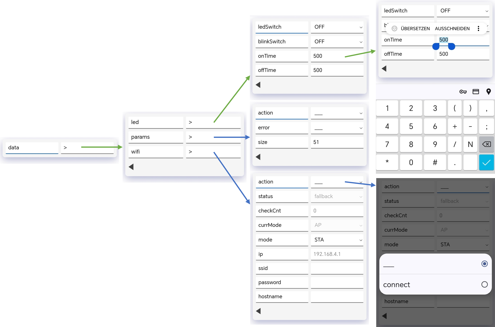

# SDDS Minimal Browser

**SDDS Minimal Browser** is a lightweight web application designed to interface with embedded devices programmed with our [SDDS](https://github.com/mLamneck/SDDS) library. If you're not familiar with SDDS yet, we recommend reading the SDDS documentation first to gain a better understanding of how the library works and how it integrates with this project.

This web application can be hosted on an ESP or other embedded devices with a footprint of only 14 KB and provides a flexible way to interact with SDDS-based systems. It supports real-time updates, value editing, and navigation through nested structures.

## Features

- **Two-column layout:** Displays variable descriptions and their values side by side.
- **Real-time updates:** Live monitoring of variable changes.
- **Editing support:** Modify values directly through the interface.
- **Substructure navigation:** Seamlessly browse nested data structures.
- **WebSocket communication:** Fetch SDDS descriptions dynamically from the device.
- **Single-file deployment:** The application can be compiled into a single HTML file.
- **Serial communication mode:** When run locally, the app can communicate with devices via a serial interface, making it suitable for boards without Wi-Fi capabilities.

## Installation & Usage

The precompiled "binaries" can be found in the [release](/release/) directory. There are two types of files: *html* and *hex*. The *hex* file is the zipped version in a format that can be included in a C program to be hosted on an ESP, for example. The *html* file can be used to access devices without WLAN via a serial interface.

### Hosting on an Embedded Device (ESP, etc.)

The website comes along with the SDDS ESP Extension. Find more information in the [repository](https://github.com/mLamneck/SDDS_ESP_Extension). We build this site into a single html file, which is zipped and converted into a hex file that can be included in C++. The full bundle is around 33 KB unzipped, and zipping reduces the footprint further to 14 KB—no problem at all to host on an ESP.

### Running Locally (Serial Interface)

Download the newest *html* file from the [release directory](/release/) and open it within your browser. Running it locally, there will be a button labeled *Connect to Serial Port*. Clicking it will present a dialog to choose the port associated with the device you want to access. After the connection has been established, you are ready to browse your data. At the time of writing, we have only tested it with Chrome, but according to the [Web Serial API documentation](https://developer.mozilla.org/en-US/docs/Web/API/Web_Serial_API), it should also work on Opera and Edge.

## Building the Application

To build the application, you must have Node.js installed and ensure that you have the necessary dependencies installed:

```sh
npm install
```

The build command and its output looks as follows.
```
npm run build

> sdds-minimalbrowser@0.0.0 build
> tsc && vite build

vite v5.0.12 building for production...
✓ 22 modules transformed.
dist/index.html  38.13 kB │ gzip: 13.63 kB
✓ built in 826ms
```

As you can see, the output will include a compiled single HTML file with a size of only around 40 kB in the `dist` directory, suitable for local deployment. We further improve the footprint by zipping the file.

```sh
python postBuild_zipAndCreateInclude.py
```

The script will copy 3 files into the `/release` directory:
 
* **sddsMinimalBrowser.html** - newest version
* **YYYYMMDD_sddsMinimalBrowser.html** - same as newest version
* **YYYYMMDD_sddsMinimalBrowser.hex.h** - zipped and converted into a C include file

The *.html* file can run in a local browser and connect to a serial port, while the `.h` is ready to be included in a C program. This is the file we are using to host this site on an ESP's when using the [WebSpike](https://github.com/mLamneck/SDDS_ESP_Extension?tab=readme-ov-file#webspike). If you're wondering how the inlcude of the file looks like, have a look at the corresponding [source](https://github.com/mLamneck/SDDS_ESP_Extension/blob/main/src/site_browser.h) file from the SDDS ESP Extension.

## Debug then Application

A local developement server can be started with the following command.

```sh
npm run build

➜  Local:   http://localhost:3000/
➜  Network: http://192.168.178.84:3000/
➜  press h + enter to show help
```

## Example Usage

### Introducing the User Interface
As mentioned in the [SDDS Core library](https://github.com/mLamneck/SDDS?tab=readme-ov-file#why-to-use-this-library), one of the key benefits of SDDS is that you don't have to worry about user interfaces, as they are created automatically based on the variables you use in your program. In the following sections, we want to introduce the web-based user interface provided by the WebSpike of the SDDS Esp Extension and give you some basics on how to use it Below is an illustration of how the user interface of our LED example program will look for one of our example projects for the ESP:



#### Navigate through the tree on mobile devices
When you browse the website, you will first see the picture on the left. We think the usage is self-explanatory, but here are some guidelines:
* Each variable in your tree is represented by two columns with the name in the left and the value in the right.
* For readonly variables, the font color in the right column is gray instead of black, and the value cannot be edited.
* Whenever you see ```>``` in the right column, it means this is a struct. You can navigate into that structure by clicking in the right column.
* You can navigate back to the parent struct by clicking the black left arrow at the bottom left.
* For non-struct variables, you can change the value by clicking in the right column with the current value. This will open up the soft keyboard or select dialog if it's an enum.

#### Navigate through the tree on Desktops
With a keyboard available, you can navigate through the tree using the arrow keys. Use the up and down arrows to select the current row indicated by the blue line below the name. Use the right key to navigate into substructures or start entering a value. Pressing the left key in the right column stops the editing process. Pressing the left key in the left column navigates back to the parent struct. While editing a value, pressing Enter accepts the value, and pressing Escape cancels the editing process.

## Requirements

- A device running SDDS firmware.
- Web browser with WebSocket or serial port support (e.g., Chrome, Edge).

## Contributing

Contributions are welcome! Feel free to submit issues or pull requests to help improve the project.

## Acknowledgments

Special thanks to the SDDS community for their contributions and support in making this project possible.

---

For more details, visit the [SDDS repository](https://github.com/mLamneck/SDDS) and start exploring!

